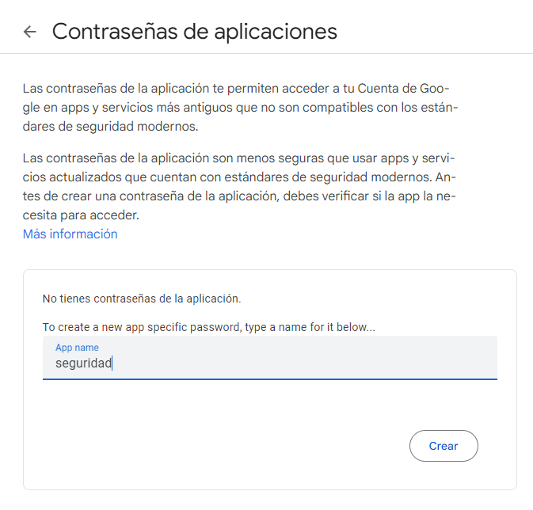
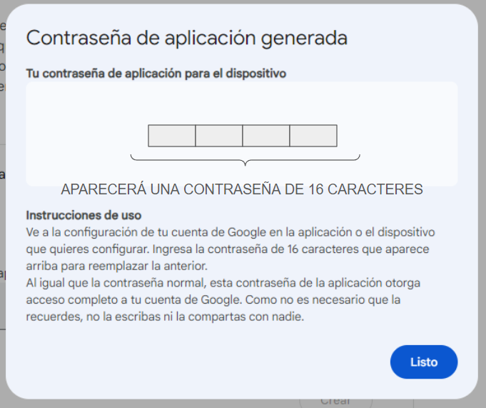

#  Sistema de Alarma de Seguridad

Las capacidades de visión computacional que integra la biblioteca YOLOv8 pueden ser utilizadas para mejorar las medidas de seguridad.
Particularmente YOLOv8, ofrece detección de objetos en tiempo real, permitiendo que el sistema identifique y responda rápidamente a posibles amenazas de seguridad. 
  
Este proyecto ofrece varias ventajas:

Detección en Tiempo Real: La eficiencia de YOLOv8 permite que el Sistema de Alarma de Seguridad detecte y responda a incidentes de seguridad en tiempo real, minimizando el tiempo de respuesta.

Precisión: YOLOv8 es conocido por su precisión en la detección de objetos, reduciendo falsos positivos y mejorando la confiabilidad del sistema de alarma de seguridad.

Capacidades de Integración: El proyecto se puede integrar fácilmente con la infraestructura de seguridad existente, proporcionando una capa mejorada de vigilancia inteligente.
  

  
<sup><sub>basado en [Tutorial security alarm system](https://docs.ultralytics.com/guides/security-alarm-system)</sub></sup>


## Puesta a punto

#### Creación de password para app


Primero crearemos una contraseña de [aplicación en google](https://myaccount.google.com/apppasswords), guardarla porque se utilizará más adelante.

Escribir un nombre para su proyecto:

  



Recepción de contraseña:

  

####  Creación de ambiente

Ahora abriremos un `anaconda prompt` o un `terminal` para crear un ambiente conda limpio, en esta ocasión utilizaremos python v3.10, por las dependencias de la biblioteca ultralytics:

```bash
conda create --name alarma python=3.10 
```

```bash
conda activate alarma 
```


#### Instalaremos las bibliotecas necesarias:

```
pip install ultralytics torch numpy opencv-python email==6.0.0a1 secure-smtplib deepface
```
opcional puede instalar `notebook` para trabajar con jupyter-notebooks o puede utilizar el IDE con el que esté más familiarizado.

```
pip install notebook
```


